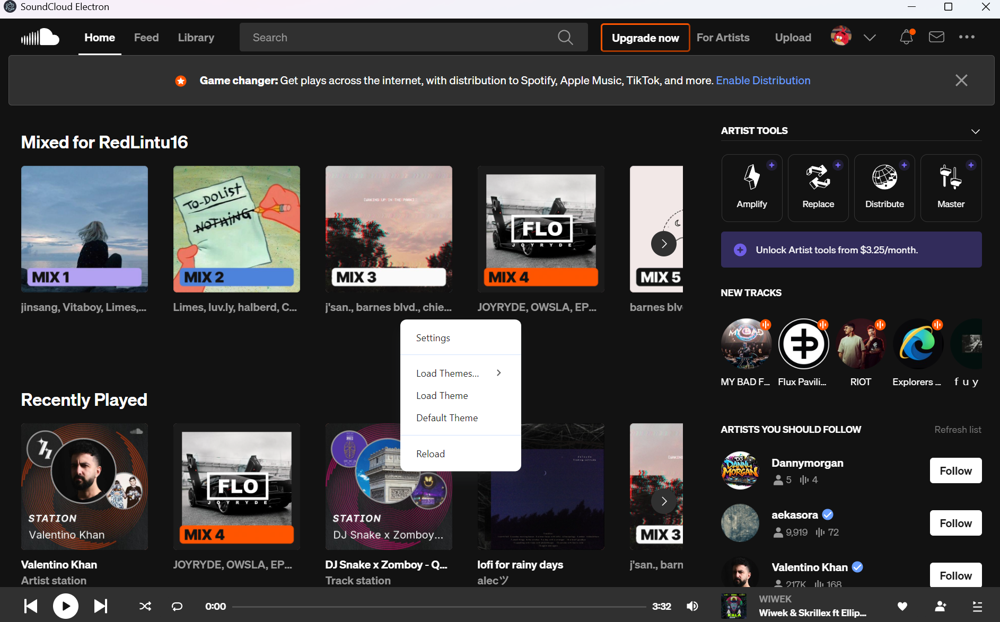
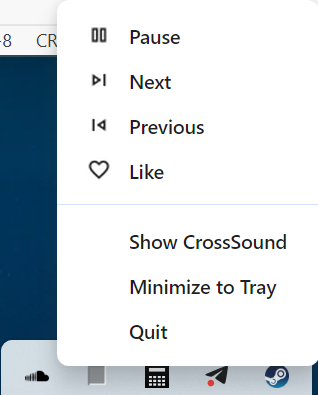

# CrossSound

# What is it?
Just a SoundCloud client that ***should*** work on Windows, Linux, and macOS. It totally works on Windows.

# Features
* Custom Themes
* Hotkey Support (You can also assing your own too!)
* Notifications for playing and pausing, and liking and unliking.
* It's ***kind of*** a real client in that you can interact with the player on your Taskbar or in the System Tray Overflow Area!

# Why?
I just wanted something that works. I had been using a different one, but it was missing some creature comforts I like. One of them being hotkey support for playing and pausing. So I just decided to make my own that supports most of what the other one did, but then add my own stuff too.

# Screenshots

